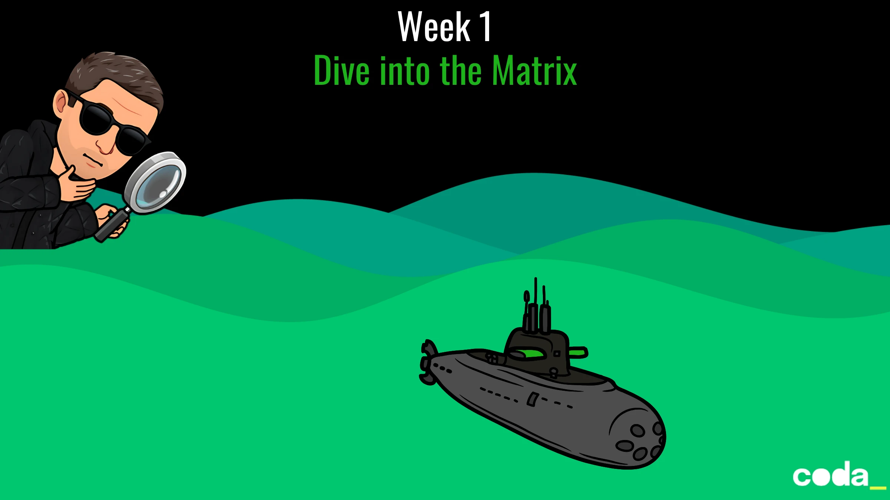

# Week 1 – *Dive into the Matrix*
## *Follow the Code, Neo*

📟 The Matrix has changed. Somewhere deep in its codebase, an anomaly has been detected—hidden beneath layers of simulation within a subroutine known as the **Trench Protocol**.

You’ve been reinserted into the Matrix inside a legacy virtual construct: an old **navigation program** designed for controlling a deep-dive mech unit. You’re not walking this time—you’re piloting a neural submarine through layers of encrypted memory, data sediment, and logic traps.

Your interface is raw code. Your only tools: a stream of text-based instructions left by a previous Operator.

You start with:

* `horizontal = 0`
* `depth = 0`

Your goal is to interpret these commands, track your position, and locate the **Access Coordinate** that will let you breach the next simulation layer.



## Commands in the Construct

The control interface accepts three commands:

* `forward X` → move **X units horizontally** across the data grid.
* `down X` → **increase depth** in the simulation stack (you sink deeper into the Matrix).
* `up X` → **decrease depth** (you move closer to the surface layer of code).

🧠 Remember: this isn't the real world. In here, *up is less*, *down is more*, and forward only takes you deeper into the illusion.

Here’s a sample log of what the previous Operator tried:

```
forward 5
down 5
forward 8
up 3
down 8
forward 2
```

### What happens:

* You move forward by 5, now `horizontal = 5`.
* You dive 5, now `depth = 5`.
* Forward 8 → `horizontal = 13`
* Up 3 → `depth = 2`
* Down 8 → `depth = 10`
* Forward 2 → `horizontal = 15`

Resulting position:

* `horizontal = 15`
* `depth = 10`

📌 The **Access Coordinate** to break through to the next layer is:
`horizontal × depth = 150`

## 🧑‍💻 Your Mission
Your job is to load the real instruction file (`submarine.txt`), parse its commands, and compute the final Access Coordinate. That value is your key. Without it, you’re trapped in this layer of the Matrix… forever.

> What’s the result of `horizontal × depth` after processing the full command list?

👓 *There is no spoon. There is only code.*

### Disclaimer
The puzzle used for this week is taken from [Advent Of Code 2021](https://adventofcode.com/2021) ([Day 2](https://adventofcode.com/2021/day/2)).
> All credits goes to AOC's team for their incredible work.

## ☕ Reflect
Take a moment to reflect on what you learned inside the Trench Protocol:

1. **Understanding the Simulation**
   *How did you model the submarine’s horizontal and vertical movement in code?*

2. **Parsing and Command Interpretation**
   *What part of the input processing was trickiest for you? Did your solution feel robust?*

3. **Debugging and Confidence**
   *What did you learn about your debugging process? What signs do you look for*

4. **Clarity vs. Cleverness** 
	*How clearly did the code reflect the real-world behavior of the system (e.g., submarine movement)? What terms or structures could you improve to make the business intent of the logic more explicit?*

> *“In the Matrix, abstraction is power. But clarity is resistance.”*
> — Morpheus, probably