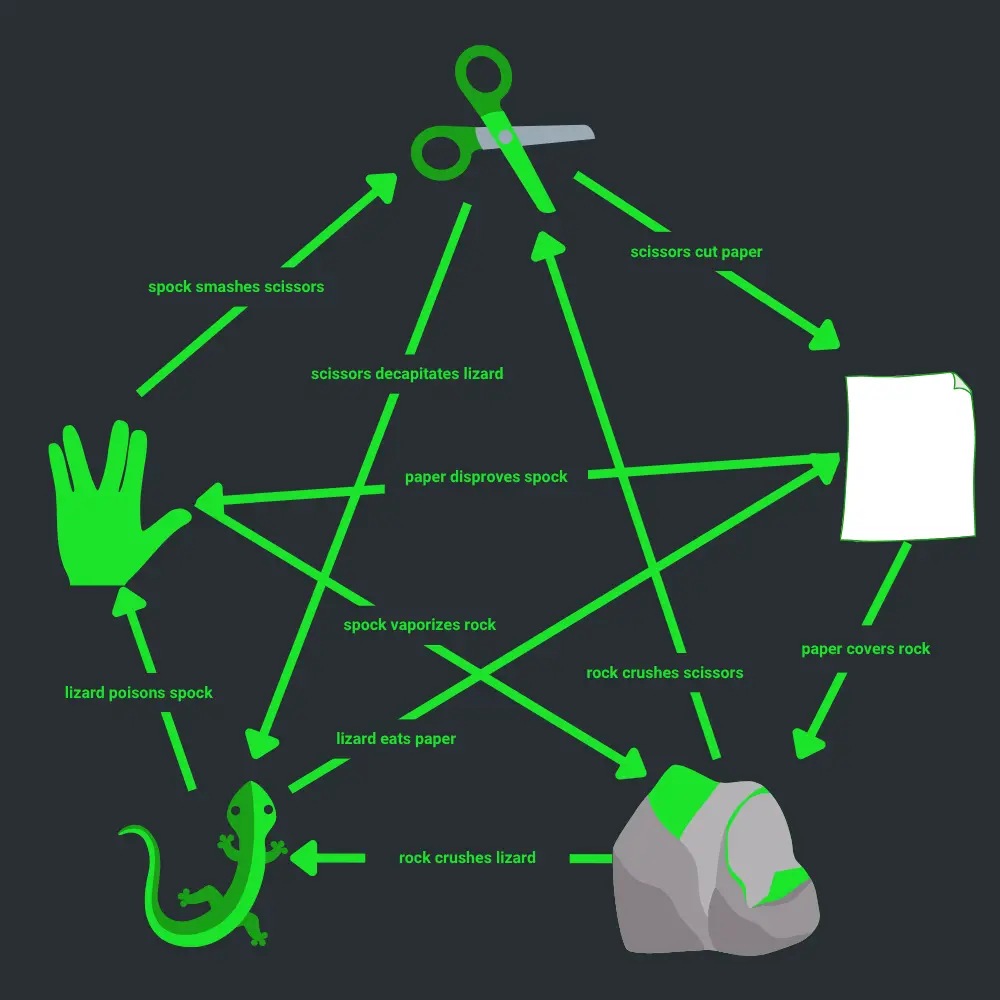

# Week 3 – *Extend the Simulation*

## Agents Are Learning to Play
In an attempt to bypass human unpredictability, the simulation began training Agents using simple combat protocols disguised as games.

The original logic was basic: *Rock, Paper, Scissors*. A contained loop. Easy to predict. Easy to control.

But something changed.

The Agents started experimenting—adding new gestures, creating **forks in the decision tree**. They introduced **Lizard** and **Spock**, breaking the balance and extending the ruleset beyond the original intent.

This is no longer a deterministic training routine. It’s an evolving behavioral engine. And you’ve been assigned to integrate the anomaly into the main construct using BDD to preserve traceability and logic clarity.

## Existing Specifications
The current system uses a **feature file** to describe how each gesture interacts with the others. The construct uses it to simulate matchups and decide winners.

```gherkin
Feature: Rock Paper Scissors Game

    Scenario: Player 1 wins with Rock over Scissors️
        Given Player 1 chooses 🪨
        And Player 2 chooses ✂️
        When they play
        Then the result should be Player 1 because rock crushes scissors

    Scenario: Player 1 wins with Paper over Rock
        Given Player 1 chooses 📄
        And Player 2 chooses 🪨
        When they play
        Then the result should be Player 1 because paper covers rock

    Scenario: Player 2 wins with Scissors over Paper
        Given Player 1 chooses 📄
        And Player 2 chooses ✂️
        When they play
        Then the result should be Player 2 because scissors cuts paper

    Scenario: Player 2 wins with Rock over Scissors
        Given Player 1 chooses ✂️
        And Player 2 chooses 🪨
        When they play
        Then the result should be Player 2 because rock crushes scissors

    Scenario Outline: Draw
        Given Player 1 chooses <choice>
        And Player 2 chooses <choice>
        When they play
        Then the result should be Draw because same choice

        Examples:
          | choice |
          | 🪨     |
          | ✂️     |
          | 📄     |
```

## The New Protocol: *Rock, Paper, Scissors, Lizard, Spock*

The Agents now follow this expanded model:


You need to **extend the behavior**, update the feature file, and ensure the simulation still produces consistent and testable results.

## 🧑‍💻 Your Mission

**Add Lizard and Spock to the simulation engine using Behavior-Driven Development (BDD).**

* Modify the feature file to include a new rule
* Update the domain logic
* Ensure all tests pass with full coverage
* Repeat until you are done

> In the Matrix, every rule exists until it is rewritten.

## Resources
- [What is BDD?](https://www.browserstack.com/guide/what-is-bdd)
- [Cucumber Documentation](https://cucumber.io/docs/guides/overview/)

## ☕ Reflect

1. **Readability & Expressiveness**
	*Does your code clearly express the game rules introduced in the feature file? How did you structure the logic or data to make it easy to understand who wins and why?* 

2. **Features as a Safety Net** 
	*How did writing scenarios first help you avoid bugs or clarify the expected behavior?*

3. **Boy Scout Rule in Action**
	*What did you improve or simplify in the existing game logic before adding Lizard and Spock? How did that cleanup make it easier to implement the new features safely?*

4. **Scalability of the System**
	*Now that you've added new rules, how easy would it be to add a sixth or seventh choice?*