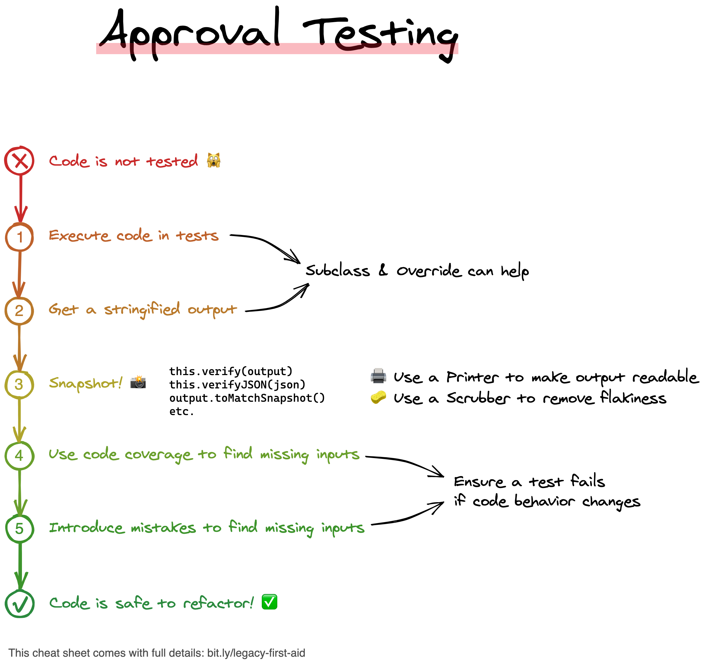

# Week 4 – *Rebuilding the Simulation Core*

## The Artefacts Are Waking Up

Zion’s simulation layer is fracturing. The **Construct Inventory**, a core engine responsible for modelling the behavior of in-world artefacts, is dangerously entangled.

The code has been patched too many times, too fast. Behaviors are hard-coded, duplicated, unreadable. Any change risks destabilizing the construct.

But now, a new need emerges.

An advanced field device—**the Stealth Cloak v2.0**—has been smuggled into the Matrix. It helps agents hide from surveillance algorithms but slowly loses integrity over time. If you don’t integrate its behavior into the simulation, it will be rejected and neutralized.

Before you can expand the simulation, you must **refactor the system** to be safer, clearer, and open to extension.

> **You are Neo. The system won’t make this easy. But Zion is watching.**

```java
class ConstructInventory {
    Artefact[] artefacts;

    public ConstructInventory(Artefact[] artefacts) {
        this.artefacts = artefacts;
    }

    public void updateSimulation() {
        for (int i = 0; i < artefacts.length; i++) {
            Artefact artefact = artefacts[i];

            if (!artefact.name.equals("Aged Signal")
                    && !artefact.name.equals("Backdoor Pass to TAFKAL80ETC Protocol")) {
                if (artefact.integrity > 0) {
                    if (!artefact.name.equals("Sulfuras Core Fragment")) {
                        artefact.integrity = artefact.integrity - 1;
                    }
                }
            } else {
                if (artefact.integrity < 50) {
                    artefact.integrity = artefact.integrity + 1;

                    if (artefact.name.equals("Backdoor Pass to TAFKAL80ETC Protocol")) {
                        if (artefact.timeToLive < 11) {
                            if (artefact.integrity < 50) {
                                artefact.integrity = artefact.integrity + 1;
                            }
                        }

                        if (artefact.timeToLive < 6) {
                            if (artefact.integrity < 50) {
                                artefact.integrity = artefact.integrity + 1;
                            }
                        }
                    }
                }
            }

            if (!artefact.name.equals("Sulfuras Core Fragment")) {
                artefact.timeToLive = artefact.timeToLive - 1;
            }

            if (artefact.timeToLive < 0) {
                if (!artefact.name.equals("Aged Signal")) {
                    if (!artefact.name.equals("Backdoor Pass to TAFKAL80ETC Protocol")) {
                        if (artefact.integrity > 0) {
                            if (!artefact.name.equals("Sulfuras Core Fragment")) {
                                artefact.integrity = artefact.integrity - 1;
                            }
                        }
                    } else {
                        artefact.integrity = artefact.integrity - artefact.integrity;
                    }
                } else {
                    if (artefact.integrity < 50) {
                        artefact.integrity = artefact.integrity + 1;
                    }
                }
            }
        }
    }
}
```

## 🧾 User Story – *Add Support for Stealth Cloak v2.0*

### **Title**: Integrate new artefact type "Stealth Cloak v2.0"

### **As**

a simulation architect from Zion,

### **I want**

to model the behavior of the new artefact type "Stealth Cloak v2.0"

### **So that**

its integrity can degrade correctly within the Construct Inventory without risking existing artefact logic.

## ✅ Acceptance Criteria
### 1. Slow decay

* Stealth Cloak loses 1 integrity every 2 days.
* It still degrades after expiration (`timeToLive < 0`), at the same pace.
* Integrity can never go below 0.

🔬 **Scenario**:

```
Given a Stealth Cloak v2.0 with timeToLive = 4 and integrity = 10  
When one day passes → integrity = 10  
When a second day passes → integrity = 9  
```

### 2. No regeneration

* Stealth Cloak never gains integrity, no matter what.

🔬 **Scenario**:

```
Given a Stealth Cloak v2.0 with integrity = 1 and timeToLive = 0  
When 4 days pass → integrity = 0  
```

### 3. Legacy compatibility

* All existing artefacts must behave exactly as before.

🔬 **Scenario**:

```
Given a simulation run with legacy artefacts  
When executed with the refactored code  
Then outputs must match the original version byte-for-byte
```

## 🧑‍💻 Your Mission

### Refactor first. Extend second.
1. Refactor the `updateQuality()` method to make it readable and open for extension
2. Implement the logic for **Stealth Cloak v2.0** cleanly, without breaking existing functionality

> [for each desired change, make the change easy (warning: this may be hard), then make the easy change - Kent Beck](https://x.com/KentBeck/status/250733358307500032?lang=fr)

## Resources
- [The key points of Refactoring](https://understandlegacycode.com/blog/key-points-of-refactoring/)
- [3 steps to add tests on existing code](https://understandlegacycode.com/blog/3-steps-to-add-tests-on-existing-code-when-you-have-short-deadlines/)
- [Approval Tests](https://approvaltests.com/)



## ☕ Reflect

1. What did you change in the structure to make behavior extensible?
2. How did you test for regressions in the existing code?
3. Did refactoring help you think more clearly about the new feature?
4. How would you add a new artefact like “Oracle Lens v1.0” next week?

> *"Code is control. But clean code is freedom."*
> — Morpheus