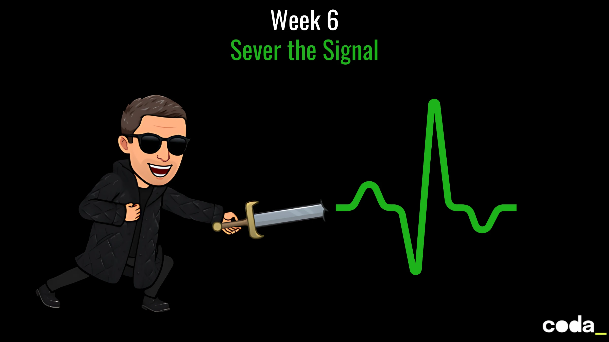

# Week 6 – *Sever the Signal*
You’ve successfully breached the Matrix’s firewall from the outside.
But Smith’s latest upgrade changed the game.

The system has begun **watching the watchers** — tracking validation logic patterns on the client side. Every keystroke leaves a trace. Every rule applied in the open becomes a weakness.

> The UI is no longer safe.

Your mission: **extract the validation logic from the React frontend** and move it **behind your firewall**, inside a secure backend service hosted on your terms.

From now on, **only the backend knows what makes a valid breach key.**
The frontend merely transmits. Silently. Invisibly.
You must **sever the signal**.



## 🧑‍💻 Your Mission

### 1. Build Zion’s Validation Core as a Backend API

Develop a **REST API** to encapsulate the Matrix breach key logic — the same rules as last week:

* Minimum 8 characters
* At least one uppercase glyph
* At least one lowercase glyph
* At least one number
* At least one **cyber-symbol**: `. * # @ $ % &`
* **Only allowed characters**

#### Endpoint

`POST /api/password-check`

**Example input:**

```json
{
  "password": "Abc123@#"
}
```

**Example output:**

```json
{
  "isValid": true,
  "errors": []
}
```

💡 *Every rule must return its individual result — no ambiguity. The resistance needs clarity to survive.*

### 2. Connect the UI Interface

Update your breach simulation interface (from `Week 5`) to connect with the backend:

* Remove all local validation logic
* On each input (or submit), call the backend API
* Render results per rule + global status (just like before)
* Add a loading spinner or animation to reflect remote processing
* Handle backend errors (timeouts, 500 errors, unreachable server)

📦 *Your frontend becomes the terminal. The backend is the brain.*


## Cybersecurity Protocols

* **No validation on the frontend** — only API-based.
* Sanitize all input on the server side.
* Assume Agent Smith is watching every unencrypted byte.

> *“Anything on the client is visible to the system. To hide, you must move underground.”*
> — Morpheus, Shadow Stack Division

## Sample Breach Attempt

> User types: `A1b#`

The API responds:

```json
{
  "isValid": false,
  "messages": ["Password must be at least 8 characters long"]
}
```

The UI shows:

❌ Too short | ✅ Uppercase | ✅ Lowercase | ✅ Number | ✅ Symbol | ✅ Allowed characters
→ Status: **Access Denied**

---

## 🧰 Zion Tech Stack (Choose Your Weapon)

You can implement your API in any backend language. Some paths:

* **Node.js + Express** 🟢
* **Python (Flask / FastAPI)** 🐍
* **PHP (Laravel / Symfony)** 🐘
* **Java (Spring Boot)** ☕
* **C# (ASP.NET Core)** ⚙️
* ...

## ✅ Mission Checklist

- [ ] Create a REST API with the password validation logic
- [ ] Implement detailed rule feedback
- [ ] Remove local validation from the frontend
- [ ] Connect the UI to the backend
- [ ] Handle errors, loading, and trace visibility
- [ ] Reflect on what this shift means for real-world cybersecurity

## ☕ Reflect
You’ve moved the breach logic beyond the visible layer, out of reach from the Agents who watch the Grid. Now reflect on what this shift taught you — not just about architecture, but about how and where logic should live:

1. **Logic Migration**
    *What challenges did you face during the migration, and how did you verify that the logic still worked as intended?*
2. **Security Mindset**
    *How would an Agent (or attacker) exploit client-side-only validation?*
3. **Frontend-Backend Collaboration**
    *How did you design the interaction between the UI and your new API?*
4. **Error Handling & UX Under Pressure**
    *How did you handle network failures, timeouts, or API errors in your UI?*

> *“A resilient system doesn’t hide errors — it learns from them.”*
> — Morpheus