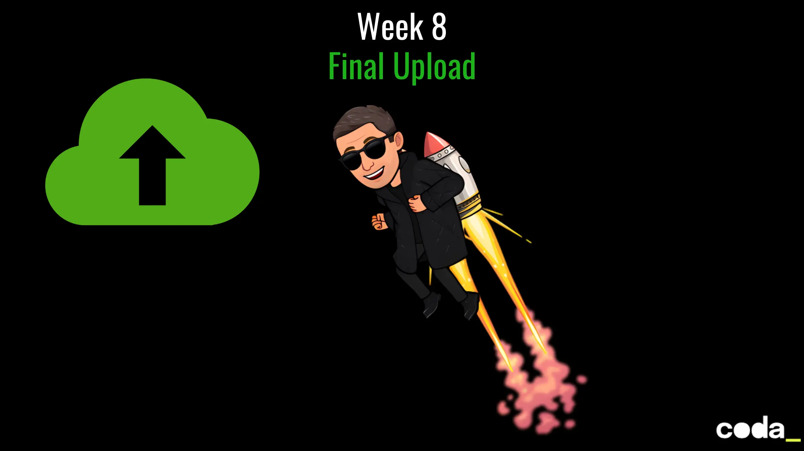

# 🕶️ Week 8 – *Final Upload*
Agent Smith has adapted.
He mirrors your every move.
Each deploy, each line of code — traced, mirrored, countered.

This is it.
The final stand. The last fight. The moment when you prove:
**You are The One.**

Your mission:
- **Automate the breach operation** across the entire stack
- **Make it self-sustaining** — no more manual pushes
- **Deploy the Grid** — and hold your ground with a single command

The future of Zion depends on your pipeline.

## 🧑‍💻 Your Mission

### Phase 1 – *CI: Continuous Resistance*

Build a CI pipeline (using `GitHub Actions` for example) triggered on each push.
It must:

1. ✅ **Scan the Code**

   * Lint the frontend (`eslint`)
   * Lint the backend

2. 🧠 **Run Combat Simulations**

   * Unit tests for both frontend and backend

3. 📊 **Trace Intelligence (optional)**

   * Upload code coverage to Codecov or generate local reports

4. ⚒️ **Assemble Zion’s Arsenal**

   * Run `vite build` for the React UI
   * Compile backend + prepare SQLite Database

🎯 Endgame: The build is green, the code is clean, and you're ready to jack in.

### Phase 2 – *Manual Deployment: Take Back the Grid*

Deploy your agents manually — one for the UI, one for the API.
Choose your node:

**Frontend Deployment Nodes**:

| Platform     | Method                    |
| ------------ | ------------------------- |
| Vercel       | GitHub / CLI (`vercel`)   |
| Netlify      | GitHub / drag-and-drop    |
| Surge.sh     | `npx surge dist`          |
| GitHub Pages | Push `dist` to `gh-pages` |
| ...          | ... |

**Backend Deployment Nodes**:

| Platform | Stack Support | Notes                          |
| -------- | ------------- | ------------------------------ |
| Render   | Full          | Supports persistent SQLite     |
| Railway  | Full          | GitHub + SQLite =              |
| Fly.io   | Full          | Edge-ready deployment          |
| Heroku   | Node, Python  | Free tier works for quick test |

📌 Zion Tip: Don’t forget to configure your frontend to call your deployed API.

### Phase 3 – *CI/CD: The One Push*

Now turn your GitHub Actions workflow into a **complete CI/CD pipeline**:

1. 🔹 **Frontend Deploy**

   * Automate via `vercel --prod`, `surge`, `netlify deploy`, or `gh-pages` or ...

2. 🔹 **Backend Deploy**

   * Trigger deployment with CLI (Fly.io, Railway, Render)
   * Or push to a branch watched by your platform

## ✅ Final Submission Checklist

* [ ] CI workflow runs: lint, test, build for both front and back
* [ ] Manual deploy to one frontend and one backend provider
* [ ] GitHub Actions deploys automatically
* [ ] Frontend points to the live backend

> *“You’ve been fighting Agent Smith with instinct. Now fight him with automation.”*
> — Morpheus

Here are **4 reflect questions** for **Week 8 – *Final Upload*** to help students consolidate their learning and awareness of modern software delivery:

### ☕ Reflect
1. **What part of the CI/CD pipeline setup was the most challenging, and why?**
   * Reflect on how build/test/deploy integration affects developer experience and system reliability.

2. **How did automating your deployment impact your confidence in delivering changes?**
   * Consider the difference between manual vs. automated delivery cycles.

3. **What security measures did you take to protect secrets and sensitive data during deployment?**
   * Think about `.env`, GitHub Secrets, and potential vulnerabilities.

4. **In a real-world system, how would you monitor and validate that your deployed environments remain stable and functional over time?**
   * Go beyond “it worked once” — what about tomorrow?