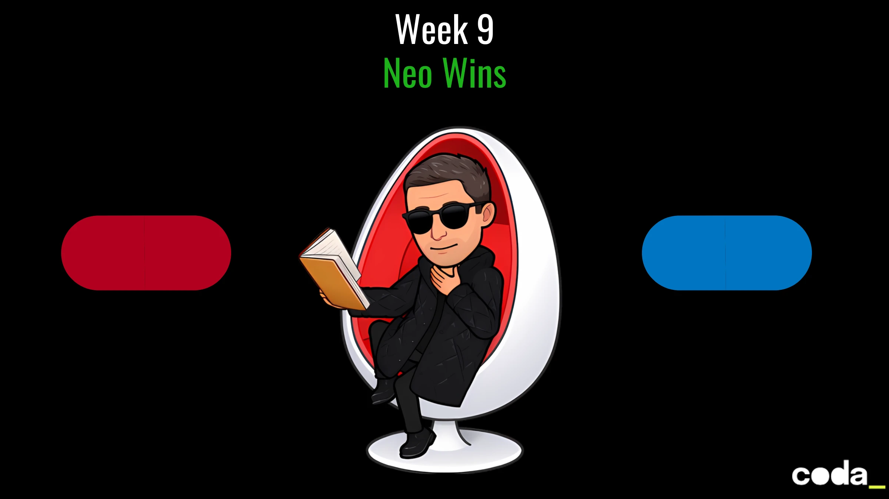
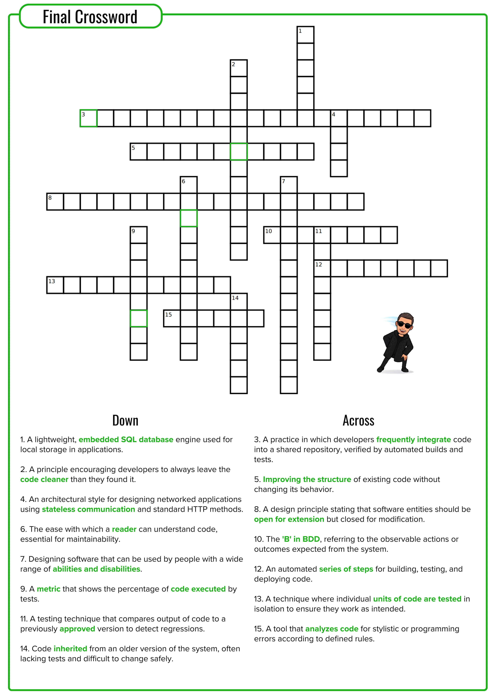

# Week 9 – *Neo Wins!*
**The Matrix is finally free.**

**Neo, you’ve done it!**

You’ve **bent the code**, **broken the rules**, and **rewritten the very fabric of the system**.

The battle with Agent Smith? **You won.**

The Firewall? **You breached it.**

The Rules Matrix? **Rewritten in your image.**

And now, as you stand victorious, you must reflect on your journey through the digital wasteland. You’ve been to the deepest depths of legacy code, refactored it, tested it, and automated the revolution. You are no longer the novice that entered the Matrix — **you are The One**.

Now, it's time for the **final test**. A challenge worthy of your journey. 

**Celebrate your success** and **solidify your learnings** before we end the mission. Let's do it.

---

## 🧑‍💻 Your Mission
### **Part 1: Crossword Challenge — Code Is Your Language**

It’s time to test how well you’ve internalized the key concepts from your 8-week journey. 
Your task is to **complete the crossword** below, where each answer corresponds to a key concept, tool, or principle covered during your journey in the Matrix.

Ready? Let’s see how well you know your Matrix.

### **Part 2: Final Reflect — Neo's Knowledge Share**

Now that you’ve defeated Agent Smith and automated your revolution, it’s time to **reflect on your entire journey**. This is where you’ll gather all your wisdom, share your learnings, and solidify the true power of your development skills.

1. **What was the most difficult challenge you faced, and how did you overcome it?**
2. **Which week or concept impacted you the most, and why?**
3. **What was your favorite moment in this whole journey? What made it memorable?**
4. **Looking forward: what will you take from this challenge into your next steps in your career?**

---

This is your **victory lap**, Neo. It’s time to show the world what you've learned, what you've accomplished, and how far you've come. From the first time you jacked into the Matrix to now — you’ve **mastered the system**.

**Congratulations!** You've completed the *Cahier de Vacances*, and you are **The One**.