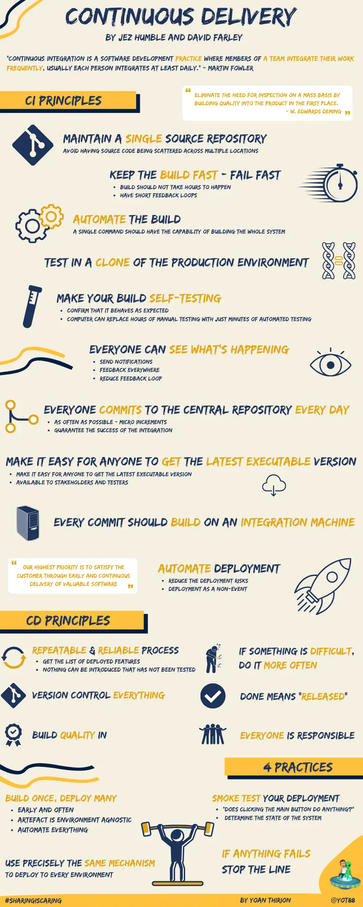

## CI/CD
### Principles


### API
The api is hosted on `Azure` through an `App Service` [here](https://matrix-api-hnbfbcaxhab2cugt.westeurope-01.azurewebsites.net/scalar/).

```yml
name: Build and deploy matrix-api on Azure

on:
  push:
    branches: [ main ]
  pull_request:
    branches: [ main ]

jobs:
  build:
    name: build
    runs-on: ubuntu-latest
    permissions:
      contents: read
    defaults:
      run:
        working-directory: ./proposed-solution/week08/api
        
    steps:
      - uses: actions/checkout@v4
        with:
          fetch-depth: 0
          
      - name: Setup .NET
        uses: actions/setup-dotnet@v3
        with:
          dotnet-version: '9.0.x'
          
      - name: Set up JDK 17
        uses: actions/setup-java@v3
        with:
          java-version: 17
          distribution: 'zulu'
        
      - name: Cache SonarCloud packages
        uses: actions/cache@v3
        with:
          path: ~\.sonar\cache
          key: ${{ runner.os }}-sonar
          restore-keys: ${{ runner.os }}-sonar
          
      - name: Install SonarCloud scanner
        run: |
          dotnet tool install --global dotnet-sonarscanner
          
      - name: Restore dependencies
        run: dotnet restore
        
      - name: Begin SonarCloud analysis
        run: |
          dotnet-sonarscanner begin /k:"ythirion_cahier-de-vacances-b3" /o:"ythirion" /d:sonar.token="${{ secrets.SONAR_TOKEN }}" /d:sonar.host.url="https://sonarcloud.io" /d:sonar.cs.opencover.reportsPaths="**/coverage.opencover.xml" /d:sonar.cs.vstest.reportsPaths="**/*.trx" /d:sonar.sources="./proposed-solution/week08/api" /d:sonar.cs.analyzer.projectOutPaths="./proposed-solution/week08/api/**/bin" /d:sonar.verbose=true
      
      - name: Build
        run: dotnet build --no-restore --configuration Release
        
      - name: Test
        run: dotnet test --no-build --configuration Release --verbosity normal --collect:"XPlat Code Coverage;Format=opencover" --logger trx --results-directory ./TestResults/
        
      - name: End SonarCloud analysis
        run: dotnet-sonarscanner end /d:sonar.token="${{ secrets.SONAR_TOKEN }}"
        env:
          GITHUB_TOKEN: ${{ secrets.GITHUB_TOKEN }}

      - name: Publish backend
        run: dotnet publish -c Release --property:PublishDir=publish
          
      - name: Archive backend build
        uses: actions/upload-artifact@v4
        with:
          name: backend-build
          path: ./proposed-solution/week08/api/FirewallCracker/publish

  deploy:
    name: deploy to azure
    runs-on: windows-latest
    needs: build
    environment:
      name: 'Production'
      url: ${{ steps.deploy-to-webapp.outputs.webapp-url }}
    permissions:
      id-token: write #This is required for requesting the JWT
      contents: read #This is required for actions/checkout

    steps:
      - name: Download artifact from build job
        uses: actions/download-artifact@v4
        with:
          name: backend-build
      
      - name: Login to Azure
        uses: azure/login@v2
        with:
          client-id: ${{ secrets.AZUREAPPSERVICE_CLIENTID_92143A8DE21F4B28BD44BEE71897B7D9 }}
          tenant-id: ${{ secrets.AZUREAPPSERVICE_TENANTID_8ADAE2E0E211425B9FEFB1BE82E6218D }}
          subscription-id: ${{ secrets.AZUREAPPSERVICE_SUBSCRIPTIONID_14D59A240C2B4EC38290490F5FD53D8C }}

      - name: Deploy to Azure Web App
        id: deploy-to-webapp
        uses: azure/webapps-deploy@v3
        with:
          app-name: 'matrix-api'
          slot-name: 'Production'
          package: .
```

### Front-end
React app is deployed on `Netlify` [here](https://matrix-b3.netlify.app/)

```yml
name: Build React App

on:
  push:
    branches: [ main ]
  pull_request:
    branches: [ main ]

jobs:
  frontend-build:
    name: build
    runs-on: ubuntu-latest
    defaults:
      run:
        working-directory: ./proposed-solution/week08/front-end

    steps:
      - uses: actions/checkout@v4
      
      - name: Setup Node.js
        uses: actions/setup-node@v4
        with:
          node-version: '20'
          cache: 'npm'
          cache-dependency-path: './proposed-solution/week08/front-end/package-lock.json'
          
      - name: Install dependencies
        run: npm ci
        
      - name: Lint frontend
        run: npm run lint
        
      - name: Install Playwright browsers
        run: npx playwright install --with-deps
        
      - name: Run e2e tests
        run: npm run test:e2e
        
      - name: Upload Playwright report
        uses: actions/upload-artifact@v4
        if: always()
        with:
          name: playwright-report
          path: ./proposed-solution/week08/front-end/playwright-report
          retention-days: 30
          
      - name: Build frontend
        run: npm run build

      - name: Archive frontend build
        uses: actions/upload-artifact@v4
        with:
          name: frontend-build
          path: ./proposed-solution/week08/front-end/dist
      
      - name: Deploy to Netlify
        uses: nwtgck/actions-netlify@v2
        with:
          publish-dir: './proposed-solution/week08/front-end/dist'
          production-branch: main
          github-token: ${{ secrets.GITHUB_TOKEN }}
          deploy-message: "Deploy from GitHub Actions"
        env:
          NETLIFY_AUTH_TOKEN: ${{ secrets.NETLIFY_AUTH_TOKEN }}
          NETLIFY_SITE_ID: ${{ secrets.NETLIFY_SITE_ID }}
```

### Badges
- SonarQube: [](https://sonarcloud.io/summary/new_code?id=ythirion_cahier-de-vacances-b3) [](https://sonarcloud.io/summary/new_code?id=ythirion_cahier-de-vacances-b3) [](https://sonarcloud.io/summary/new_code?id=ythirion_cahier-de-vacances-b3) [](https://sonarcloud.io/summary/new_code?id=ythirion_cahier-de-vacances-b3)
- Github Actions: [](https://github.com/ythirion/cahier-de-vacances-b3/actions/workflows/api-ci.yml) [](https://github.com/ythirion/cahier-de-vacances-b3/actions/workflows/front-ci.yml)
- Codescene: [](https://codescene.io/projects/67732) [](https://codescene.io/projects/67732)